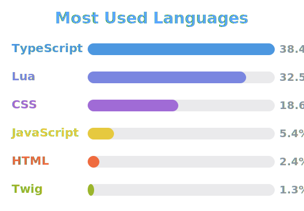

<!--
  GitHub profile README for @0marware
  Place this file at the root of your special repo:  github.com/0marware/0marware  ->  README.md
  Cards use transparent backgrounds (bg_color=00000000) so they adapt to GitHub light & dark mode.

  Stats + language cards are served from your own private-aware instance:
  https://github-readme-stats-5xfc.vercel.app  (counts your private repos).
  Tip: also enable GitHub > Settings > Public profile > "Include private contributions on my profile"
  so the streak/activity graphs reflect private work too.
-->

<h1 align="center">Hi, I'm Omar 👋</h1>

  <b>Full-Stack Developer</b> &nbsp;·&nbsp; <b>FiveM Resource Developer</b> &nbsp;·&nbsp; <b>Co-Founder @ NANO Scripts</b>

  
  
  

---

### 🧑‍💻 About me

- 👨‍💼 Co-Founder & developer at **[NANO Scripts](https://nanoscripts.tebex.io/)** — premium **FiveM** roleplay resources for **QBCore** & **ESX** communities.
- 🎮 I build immersive gameplay systems: heists, surveillance, HUDs, job & gang frameworks, and the tooling around them.
- 🧠 Primarily **Lua** for in-game resources, with **TypeScript** for panels, tooling & integrations.
- 🎓 Background in **Software Engineering (ALX)** — from low-level **C** and systems/DevOps to full-stack web.
- 📫 Reach me through the **[NANO Scripts store](https://nanoscripts.tebex.io/)** or Discord.

---

### 🛠️ Tech Stack

**Languages**

**Platforms & Tools**

---

### 📊 GitHub Stats

  
  

  

  

---

### 🚀 Featured Work — NANO Scripts

> Premium FiveM systems I design & maintain — all **private / closed-source**, available through the [store](https://nanoscripts.tebex.io/).

| Project | What it does | Stack | Source |
| :--: | :--: | :--: | :--: |
| 🔒 Private | Private | Private | Private |

---

### 🧭 Journey & Past Work

- 🟢 **Now —** Co-Founder @ NANO Scripts, shipping commercial FiveM resources to roleplay communities.
- 🌐 **Full-stack web —** IT-equipment / store-management systems (`gestion-magasin-informatique`) in PHP & JavaScript.
- 🎓 **ALX Software Engineering —** low-level & systems foundations: `simple_shell` (a Unix shell in C), `alx-low_level_programming` (C), `alx-system_engineering-devops` (Bash/Linux).
- 🧱 **First steps —** HTML/CSS & Codecademy challenge projects where it all started.

---

<i>⚡ Turning roleplay ideas into shipped FiveM resources, one commit at a time.</i>

